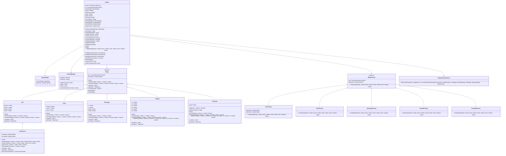

```mermaid
classDiagram
    class Canvas {
        -canvas: HTMLCanvasElement
        -ctx: CanvasRenderingContext2D
        -drawingState: DrawingState
        -shapes: Shape[]
        -isDrawing: boolean
        -startX: number
        -startY: number
        -isErasing: boolean
        -currentShape: Shape
        -historyManager: HistoryManager
        -lineStartShape: EndpointShape
        -lineEndShape: EndpointShape
        -shapeFactory: ShapeFactory
        +setCurrentShape(shape: ShapeType)
        +saveState() string
        +loadState(dataURL: string)
        +setLineColor(color: string)
        +setFillColor(color: string)
        +setLineWidth(width: number)
        +setLineStyle(style: LineStyle)
        +setOpacity(opacity: number)
        +toggleEraseMode()
        +disableEraseMode()
        +undo()
        +redo()
        -createShape(startX: number, startY: number, endX: number, endY: number) Shape
        -handleMouseDown(event: MouseEvent)
        -handleMouseMove(event: MouseEvent)
        -handleMouseUp(event: MouseEvent)
        -eraseAtPoint(x: number, y: number)
        -redrawShapes()
        +saveCanvas() string
        +loadCanvas(jsonData: string)
    }

    class DrawingState {
        +currentShape: ShapeType
        +properties: ShapeProperties
    }

    class HistoryManager {
        -undoStack: Action[]
        -redoStack: Action[]
        +addAction(action: Action)
        +undo() Action
        +redo() Action
        -reverseAction(action: Action) Action
    }

    class Shape {
        <<abstract>>
        #ctx: CanvasRenderingContext2D
        #properties: ShapeProperties
        +draw()
        +isPointInside(x: number, y: number) boolean
        +isPointNearEdge(x: number, y: number, threshold: number) boolean
        +serialize() object
        +getType() ShapeType
        +isTransparent() boolean
        #applyStyles()
        #resetStyles()
    }

    class Line {
        #startX: number
        #startY: number
        #endX: number
        #endY: number
        +draw()
        +isPointInside(x: number, y: number) boolean
        +isPointNearEdge(x: number, y: number, threshold: number) boolean
        +serialize() object
        +getType() ShapeType
    }

    class CustomLine {
        -startShape: EndpointShape
        -endShape: EndpointShape
        +draw()
        -drawEndpoint(x: number, y: number, shape: EndpointShape, angle: number)
        -drawArrowhead(x: number, y: number, angle: number, size: number)
        -drawCircle(x: number, y: number, radius: number)
        +isPointInside(x: number, y: number) boolean
        +serialize() object
        +getType() ShapeType
        +getCustomProperties() CustomLineProperties
    }

    class Circle {
        -centerX: number
        -centerY: number
        -radius: number
        +draw()
        +isPointInside(x: number, y: number) boolean
        +isPointNearEdge(x: number, y: number, threshold: number) boolean
        +serialize() object
        +getType() ShapeType
    }

    class Rectangle {
        -x: number
        -y: number
        -width: number
        -height: number
        +draw()
        +isPointInside(x: number, y: number) boolean
        +isPointNearEdge(x: number, y: number, threshold: number) boolean
        +serialize() object
        +getType() ShapeType
    }

    class Triangle {
        -x1: number
        -y1: number
        -x2: number
        -y2: number
        -x3: number
        -y3: number
        +draw()
        +isPointInside(x: number, y: number) boolean
        +isPointNearEdge(x: number, y: number, threshold: number) boolean
        -distanceToLine(px: number, py: number, x1: number, y1: number, x2: number, y2: number) number
        +serialize() object
        +getType() ShapeType
    }

    class Freehand {
        -points: Point[]
        +addPoint(x: number, y: number)
        +addPoints(points: Point[])
        +draw()
        +isPointInside(x: number, y: number) boolean
        +isPointNearEdge(x: number, y: number, threshold: number) boolean
        -distanceToLine(x: number, y: number, x1: number, y1: number, x2: number, y2: number) number
        +serialize() object
        +getType() ShapeType
    }

    class ShapeFactory {
        <<abstract>>
        #ctx: CanvasRenderingContext2D
        #properties: ShapeProperties
        +createShape(startX: number, startY: number, endX: number, endY: number) Shape
    }

    class LineFactory {
        -startShape: EndpointShape
        -endShape: EndpointShape
        +createShape(startX: number, startY: number, endX: number, endY: number) Shape
    }

    class CircleFactory {
        +createShape(startX: number, startY: number, endX: number, endY: number) Shape
    }

    class RectangleFactory {
        +createShape(startX: number, startY: number, endX: number, endY: number) Shape
    }

    class TriangleFactory {
        +createShape(startX: number, startY: number, endX: number, endY: number) Shape
    }

    class FreehandFactory {
        +createShape(startX: number, startY: number, endX: number, endY: number) Shape
    }

    class ShapeFactoryProducer {
        +getFactory(shapeType: ShapeType, ctx: CanvasRenderingContext2D, properties: ShapeProperties, startShape: EndpointShape, endShape: EndpointShape) ShapeFactory
    }

    Canvas --> DrawingState
    Canvas --> HistoryManager
    Canvas --> Shape
    Canvas --> ShapeFactory
    Shape <|-- Line
    Shape <|-- Circle
    Shape <|-- Rectangle
    Shape <|-- Triangle
    Shape <|-- Freehand
    Line <|-- CustomLine
    ShapeFactory <|-- LineFactory
    ShapeFactory <|-- CircleFactory
    ShapeFactory <|-- RectangleFactory
    ShapeFactory <|-- TriangleFactory
    ShapeFactory <|-- FreehandFactory
    Canvas --> ShapeFactoryProducer
```
